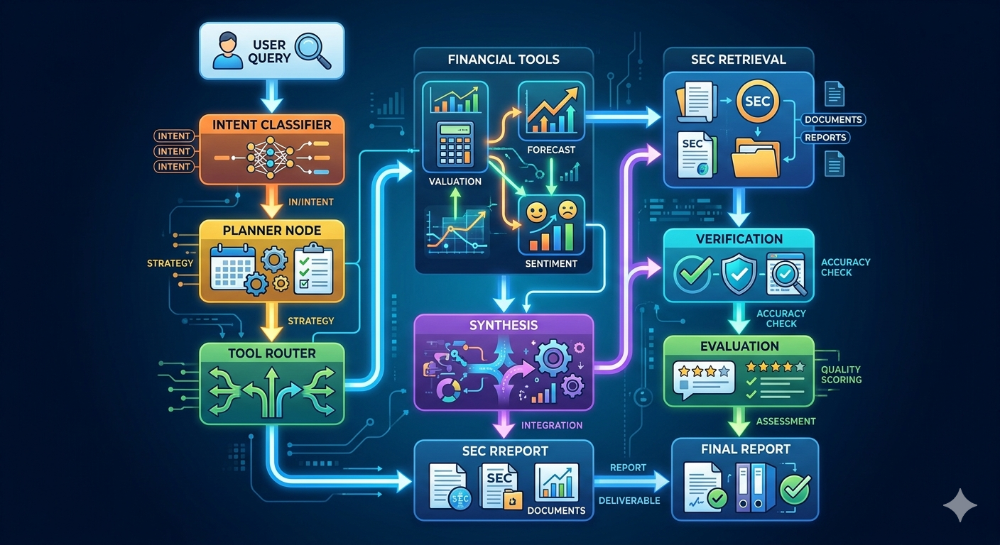
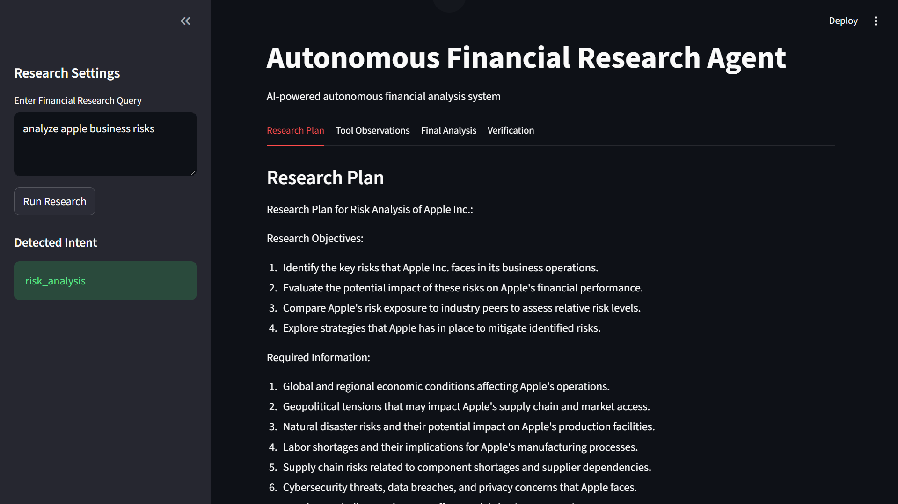
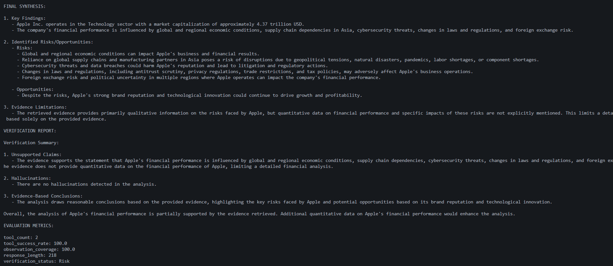
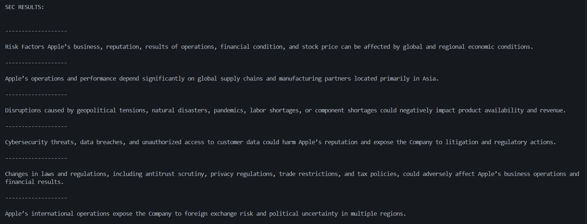
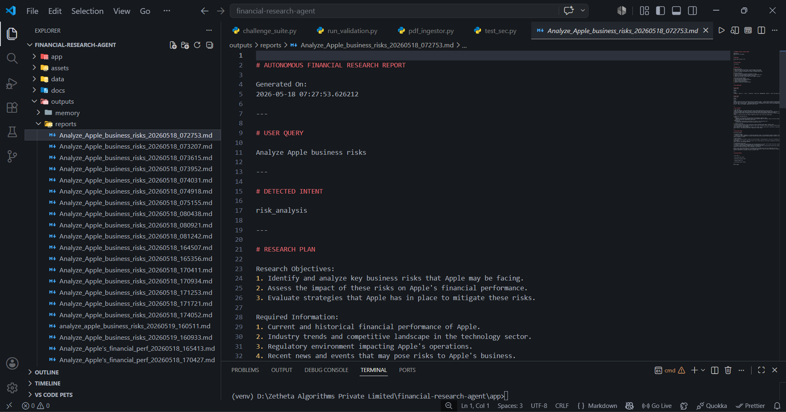

# Autonomous Financial Research Agent

AI-powered autonomous financial analysis and research system built using multi-step agentic workflows, financial retrieval pipelines, SEC-grounded evidence analysis, verification systems, and evaluation frameworks.

---

# Project Overview

The Autonomous Financial Research Agent is a modular AI system designed to perform structured financial research tasks using autonomous workflows.

The system can:

- Understand financial research queries
- Classify user intent
- Route queries to relevant financial tools
- Retrieve SEC-based risk disclosures
- Generate grounded financial analysis
- Verify evidence consistency
- Evaluate workflow performance
- Generate structured research reports

The project demonstrates concepts inspired by modern AI systems engineering, including:

- Agentic orchestration
- Financial RAG pipelines
- Intent-aware execution
- Verification frameworks
- Evaluation pipelines
- Autonomous research workflows

---

# Features

## Core AI Workflow Features

- Intent Classification
- Autonomous Research Planning
- Tool Routing Engine
- Multi-Tool Financial Analysis
- SEC Filing Retrieval
- Risk-Focused Evidence Extraction
- Financial Synthesis Engine
- Verification & Hallucination Detection
- Evaluation Metrics Pipeline
- Automated Report Generation
- Validation Benchmark Suite
- Persistent Memory Support

---

# Supported Financial Query Types

The system currently supports:

| Intent Type           | Example Query                         |
| --------------------- | ------------------------------------- |
| company_overview      | What is Apple?                        |
| stock_analysis        | What is Apple's stock price?          |
| news_research         | Get latest Apple news                 |
| risk_analysis         | Analyze Apple business risks          |
| sec_filing_analysis   | Summarize Apple SEC disclosures       |
| financial_performance | Analyze Apple's financial performance |

---

# System Architecture

```text
User Query
    ↓
Intent Classifier
    ↓
Planner Node
    ↓
Tool Router
    ↓
Financial Tools
    ↓
SEC Retrieval Pipeline
    ↓
Synthesis Node
    ↓
Verification Node
    ↓
Evaluation Metrics
    ↓
Final Research Report
```

# Architecture Diagram



---

# Dashboard Preview



# Validation Framework



# SEC Retrieval Pipeline



# Generated Research Report



---

# Project Structure

```text
financial-research-agent/
│
├── app/
│   ├── classifier/
│   ├── evaluation/
│   ├── ingestion/
│   ├── memory/
│   ├── reports/
│   ├── tools/
│   ├── utils/
│   ├── validation/
│   ├── workflow/
│   ├── dashboard.py
│   └── main.py
│
├── data/
│   ├── documents/
│   └── pdfs/
│
├── outputs/
│   └── reports/
│
├── requirements.txt
├── README.md
└── .env
```

---

# Technologies Used

## AI & Agent Frameworks

- Python
- LangGraph
- LangChain
- OpenRouter API

## Financial & Retrieval Tools

- yFinance
- SEC Risk Retrieval
- Custom Financial Tool Routing

## Dashboard & Visualization

- Streamlit

## Data Processing

- pypdf
- Regex-based Chunking
- Text Retrieval Pipelines

---

# Installation

## 1. Clone Repository

```bash
git clone https://github.com/raghu-3113/autonomous-financial-research-agent
cd financial-research-agent
```

## 2. Create Virtual Environment

```bash
python -m venv venv
```

## 3. Activate Virtual Environment

### Windows

```bash
venv\Scripts\activate
```

### Linux / Mac

```bash
source venv/bin/activate
```

## 4. Install Dependencies

```bash
pip install -r requirements.txt
```

## 5. Configure Environment Variables

Create `.env`

```env
OPENROUTER_API_KEY=your_api_key
```

---

# Running the Project

## Launch Dashboard

```bash
streamlit run app/dashboard.py
```

---

# Validation Suite

The project includes a structured validation framework containing multiple benchmark challenges.

## Run Validation Suite

```bash
cd app
python -m validation.run_validation
```

## Validation Scenarios

- Company Overview
- Stock Analysis
- News Research
- Business Risk Analysis
- SEC Filing Analysis
- Financial Performance Analysis
- Supply Chain Risk Analysis
- Business Model Analysis

---

# Example Queries

```text
What is Apple?

What is Apple's stock price?

Analyze Apple business risks

What supply chain risks does Apple face?

Summarize Apple's SEC disclosures
```

---

# Evaluation Metrics

The system automatically evaluates:

- Tool Count
- Tool Success Rate
- Observation Coverage
- Response Length
- Verification Status

---

# SEC Retrieval Pipeline

The system includes a simplified financial RAG pipeline:

```text
SEC Document
    ↓
Text Extraction
    ↓
Chunk Processing
    ↓
Risk Keyword Retrieval
    ↓
Evidence Selection
    ↓
Grounded Financial Analysis
```

---

# Current Capabilities

- Autonomous workflow orchestration
- Intent-aware tool execution
- Financial evidence retrieval
- SEC-grounded risk analysis
- Verification-based synthesis
- Automated evaluation pipeline
- Interactive dashboard workflows

---

# Future Improvements

Potential future enhancements:

- Vector database integration
- Embedding-based retrieval
- Real-time market APIs
- Multi-company comparison workflows
- Advanced memory systems
- Agent collaboration frameworks
- Financial chart generation
- Better SEC parsing pipelines

---

# Disclaimer

This project is intended for educational and research purposes only.
It does not provide financial advice.

---

# Author

Raghu Babu

B.Tech AI & Data Science

Autonomous Financial AI Research Project
